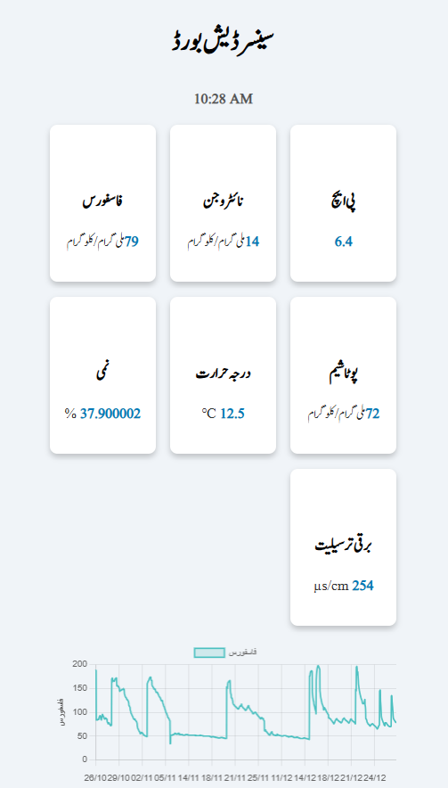

# 📊 Kissan Dost – Live IoT Sensor Dashboard

This web-based dashboard displays **live sensor readings** every 30 minutes using PostgreSQL data from IoT devices deployed in the field. It is a real-time companion to the [Kissan Dost ecosystem](https://github.com/yourusername/kissan-dost), offering intuitive visualizations for farmers and researchers.

---

## ⚙️ Features

- 📡 **Live IoT updates** pulled every 30 minutes
- 🌱 Displays real-time **soil pH**, **moisture**, **NPK**, **temperature**, and **conductivity**
- 📈 Interactive **graph overlays** for trends in Urdu
- 🌐 Clean Urdu interface using EJS templates
- 🧠 Backed by the same PostgreSQL DB as the FastAPI app



---

## 🚀 Getting Started

### 1️⃣ Clone the Repo

```bash
git clone https://github.com/DaaniKhan/Agri-Dash.git
cd Agri-Dash
```

### 2️⃣ Install Dependencies

```bash
npm install
```

### 3️⃣ Create `.env` File

```env
DB_NAME=kissanDost
DB_USER=your_db_user
DB_PASS=your_db_pass
DB_HOST=localhost
DB_PORT=your_db_port
```

---

## ▶️ Running the Server (locally)

```bash
node server.js
```

Open in your browser:

```
http://localhost:3000
```

---

## 🧠 How It Works

- Uses Express + EJS to render a live Urdu dashboard
- Fetches readings from the `readings` table using `getLatestReadingByUserID()`
- Data is automatically refreshed via AJAX + JavaScript every 30 minutes
- Users can click on sensor cards to view historical trends via Chart.js

---

## 📂 Project Structure

```bash
.
├── server.js             # Express server + API routes
├── db.js                 # PostgreSQL DB connection
├── db_controller.js      # Reading queries
├── refresh.js            # JS polling + graph logic
├── index.ejs             # Urdu dashboard UI (EJS)
├── styles.css            # Styling for cards/grid
├── dash-graph.png        # Screenshot for documentation
└── .env                  # DB credentials
```

---

## 🔍 Sample Routes

| Method | Endpoint                       | Description                  |
|--------|--------------------------------|------------------------------|
| `GET`  | `/`                            | Render live dashboard        |

---

## 🙌 Credits

- 💡 Built as part of the **Kissan-Dost** ecosystem.